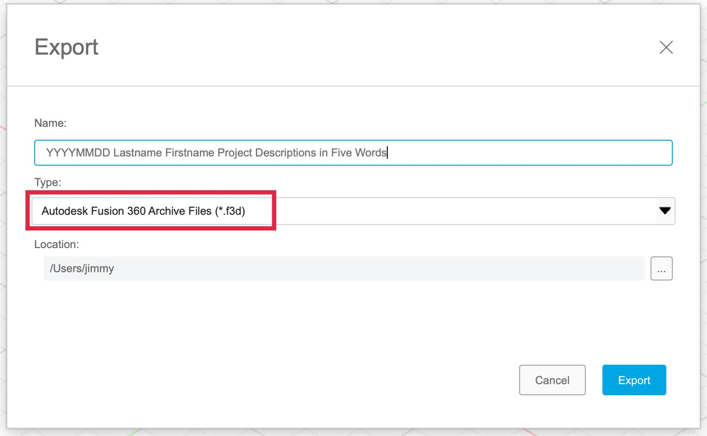

Since Fusion 360 data is stored in the cloud it is good practice to make local copies as well. Fusion 360 supports the export of many 3D Modeling file types but for now we will focus on the .f3d Fusion 360 native file format. This allows you to save a copy that can be opened on a computer without the internet and can be shared with another Fusion 360 user without sharing any cloud information. The .f3d file can be uploaded to Fusion 360 and then it will appear in the file browser with all the other models and designs.

| Export .f3d File from Fusion 360                                                      |                                                                                                                  |
| ------------------------------------------------------------------------------------- | ---------------------------------------------------------------------------------------------------------------- |
| 1. Select File from the disk icon in the top left                                     |              |
| 2. Select Export... from the dropdown menu                                            |         |
| 3. Select .f3d for the filetype in the popup window                                   |  |
| 4. Label your file with YYYYMMDD Lastname Firstname Project Description in Five Words |                                                                                                                  |
| 5. Choose a location on your computer to save the .f3d file                           |                                                                                                                  |

