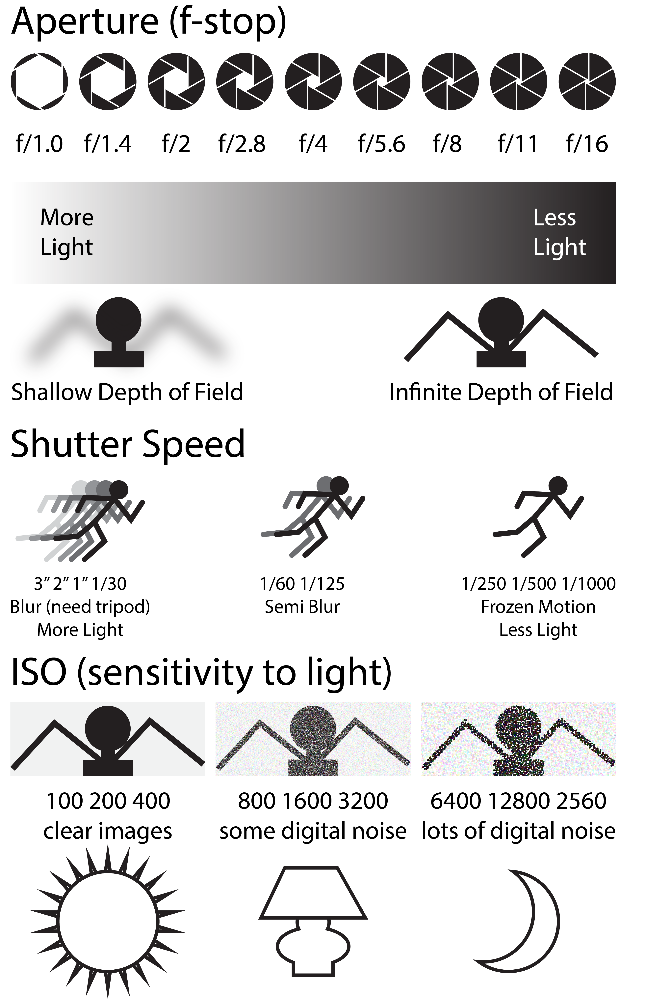

## Can I Use my Cellphone?

Yes, but you shouldn't. Cellphone cameras have small sensor sizes, unadjustable apertures, low resolution, and low quality lenses.

The camera sensor on your cell phone is too small to take photos in low light settings and the color depth will be less since it saves a JPG or HEIC file by default. You can set a cellphone to capture RAW images but, even with RAW images on a cellphone, the quality is limited by the small sensor and the lower resolution of the final image compared to a larger sensor mirrorless or DSLR Camera.

Cellphone cameras are great for taking pictures when a better camera is not available but in most artwork documentation settings a cellphone camera's image will not do your artwork any favors and might actually make it look worse. If you do document artwork with a cellphone make sure to set the camera app to take RAW photos. In a well lit environment such as outdoor sunshine, a cellphone camera can take a decent photo but your future self will thank you for taking a higher resolution, higher quality photo with the larger sensor and better lens of a higher quality camera.

## What Camera Should I Use?

Use a mirrorless camera or a DSLR camera to take high resolution documentation photos of your welded sculptures. Do not use your cell phone to take documentation photos.

## What Camera and Lights Should I Checkout?

On the [CIA Equipment Checkout Page](https://cia.webcheckout.net/sso/patron#!/) choose one of the [SONY A6100 mirrorless cameras](https://cia.webcheckout.net/sso/patron#!/category/23050497), a [Neweer LED Light Kit](https://cia.webcheckout.net/sso/patron#!/category/22013131), and a [Basic Tripod](https://cia.webcheckout.net/sso/patron#!/category/104834).

## Process

1.  Place your 3D object in front of a neutral background. This can be indoors or outdoors.
2.  It is best to have the object as far away from the background as possible. This avoids cast shadows on the background. Some objects may benefit from showing the interesting cast shadows on the wall. If you want to show the shadows then place the object closer to the background. Take photos with shadows and without so you have options later.
3.  Set up your lights. Angle them at 45 degrees pointing at the object. You can add a third back light or rim light to have reflected light on the back edges. You will need to move the lights around and take test images to see what works best. Expect to make many lighting changes. Use extension cords to have greater mobility with the lights.
4.  Put the camera on a tripod. If you need to get the camera lower than the tripod can go, then you can set it on books or a box.
5.  Set camera to take the highest quality, highest resolution images (Check this in the menu because the previous user may have changed the settings)
6.  Capture RAW images (You can set the camera to capture RAW and JPG images but the RAW is the most important format to capture for post processing.)
7.  Set the ISO to a low number like 100 or 200 (Low ISO settings, sensor sensitivity, are less important with newer cameras but it is still better to use a low ISO if the subject is stationary like your sculptures.)
8.  Set the Camera to Manual. (This is the M on the dial.)
9.  Choose an Aperture. (Use a small aperture, big number, to have everything in focus. Use a large aperture, small number, to have a shallow depth of field with only parts of the image in focus.)
10. Frame your image, filling the viewport with as much of the sculpture as possible.
11. Adjust the shutter speed until the image appears well exposed in the viewport. If the shutter speed becomes long, then use a 2 second timer so you don't shake the camera when taking the photo. Just pressing the button can shake the camera enough to make a blurry photo with slow shutter speeds.
12. Take wide shots, full shots, and detail shots. Take shots from multiple angles. It is much easier to take lots of images now then to set everything back up again.
13. Bracket the exposure by changing the shutter speed up and down, then taking additional images. You can also bracket by adjusting the aperture or F-Stop up and down.
14. Copy all the images onto your computer. Double check that you have RAW images on your laptop before you take down the lights and pack everything up.
15. Open the images in Adobe Camera Raw.
16. Make white balance, exposure, and other image corrections.
17. Remove any defect in the image with the healing brush.
18. Save the RAW images.

## Camera and Photo Editing Resources

Below is a camera setting cheat sheet that shows how ISO, Aperture and Shutter Speed change the image. There are also videos about [White Balance](https://youtu.be/m0yZEWUSahk) and [Adobe Camera Raw](https://youtu.be/11jwSwUu2WI). Email if you have any questions about the cameras or any part of the project. You can also ask the equipment checkout about the camera settings.

<iframe class="youTubeIframe" title="YouTube video player" src="https://www.youtube.com/embed/11jwSwUu2WI" width="560" height="315" allowfullscreen="allowfullscreen" allow="accelerometer; autoplay; clipboard-write; encrypted-media; gyroscope; picture-in-picture"></iframe>

><iframe class="youTubeIframe" title="YouTube video player" src="https://www.youtube.com/embed/m0yZEWUSahk" width="560" height="315" allowfullscreen="allowfullscreen" allow="accelerometer; autoplay; clipboard-write; encrypted-media; gyroscope; picture-in-picture"></iframe>

><iframe class="youTubeIframe" title="YouTube video player" src="https://www.youtube.com/embed/ftMICesJwGc" width="560" height="315" allowfullscreen="allowfullscreen" allow="accelerometer; autoplay; clipboard-write; encrypted-media; gyroscope; picture-in-picture"></iframe>

