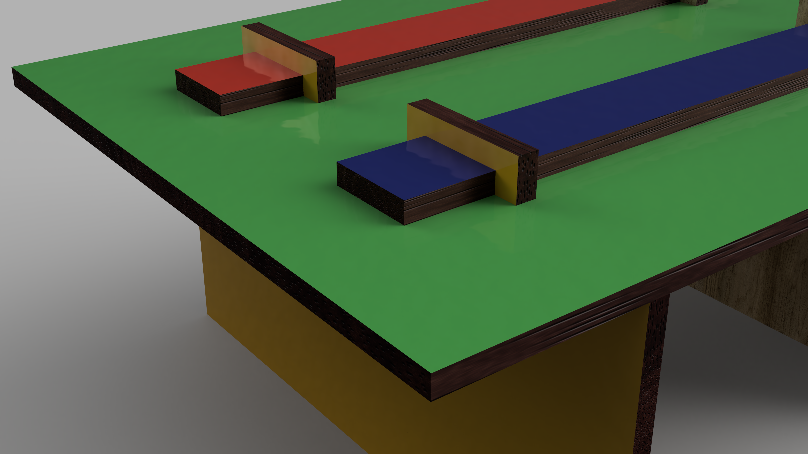

Laser Cut Joints

There are many ways to join a laser cut project together ranging from gravity to glue to bolts to snap pieces. You can use a variety of ways to connect. Here are some example images of different methods of joining pieces together. There are many more ways. Search the internet for other methods of making laser cut joints.

Box with finger joints on all sides

Snap joint pulled apart

Snap joint pressed together

Captive bolt / nut joints laid flat

Captive bolt / nut joint without aligning fingers

Captive bolt / nut joint with alignment tabs / fingers

Pinned finger joint with different pieces colorized

Pinned finger joint

