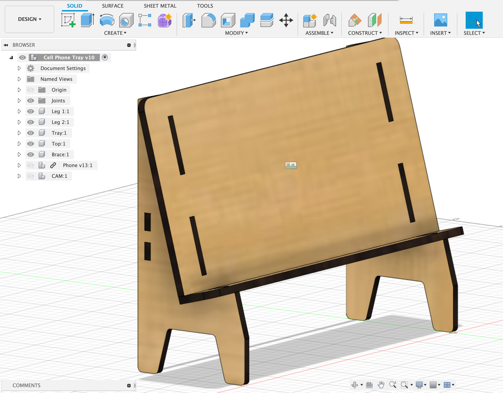

## Use User Parameters

Use a user parameter of "ply" so you can update your design after measuring your material. Use this dimensions in your sketches as a guide rather than typing in the thickness of the plywood as a hard coded value. This allows for updating. You can also make parameters for the device width, the size of bolt holes and any other feature that you might want to change or have a relationship to other features.

You can also use a user parameter for the inner width to space out pieces. Use user parameters for anything that you want to reference or update later.

Example User Parameters in Fusion 360

Example of each part of the stand as a separate component at the top level assembly in Fusion 360.

## Change Plywood Thickness Fusion 360

<iframe class="youTubeIframe" style="position: absolute; top: 0; bottom: 0; left: 0; width: 100%; height: 100%; border: 0; z-index: 1;" src="https://www.youtube.com/embed/a7HOiBC_81s?rel=0" width="560" height="315" frameborder="0" allowfullscreen="allowfullscreen"></iframe>

