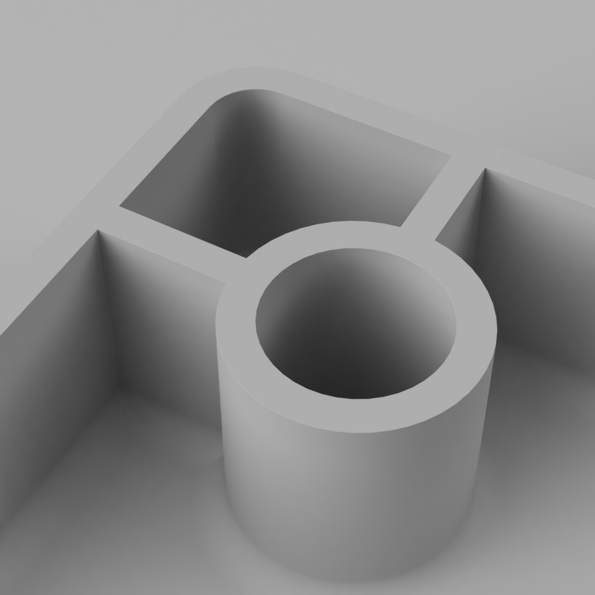
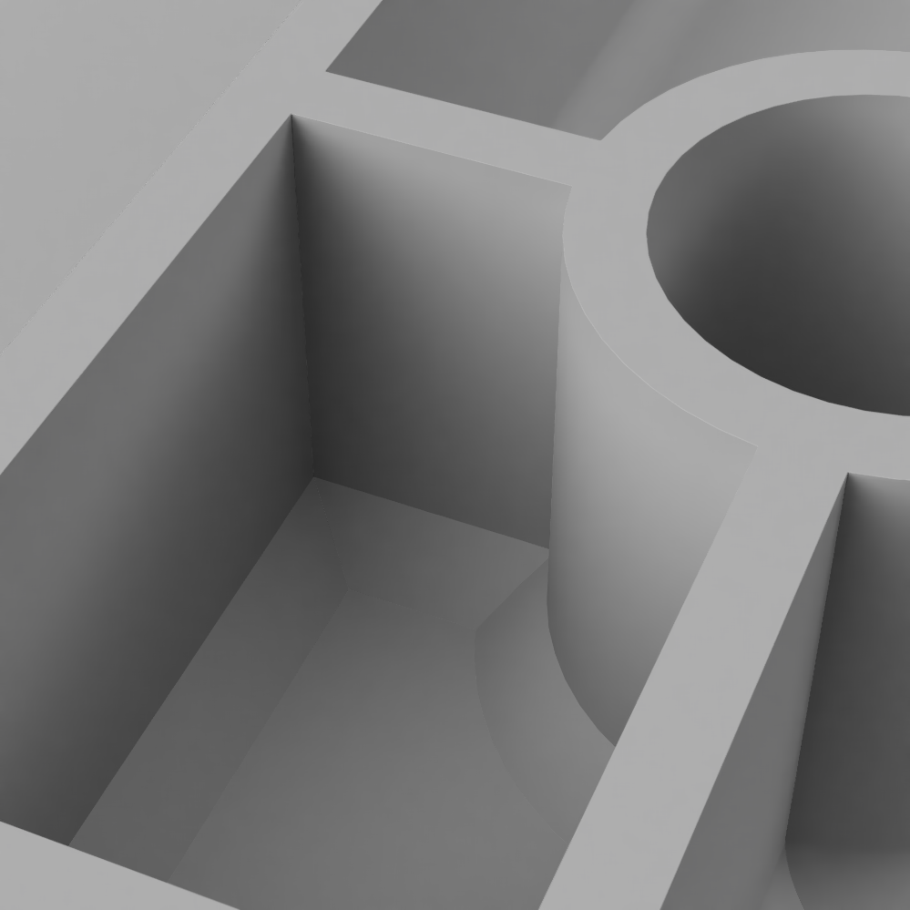

## General 3D Print Rules for FFD Printing without Dissolvable Supports

- Keep thin and small parts multiples of the nozzle size. The nozzle at the think[box] is .4mm absolute minimum size of fine objects is 1.2mm. A better size for thin walls and supports is 1.6mm. 1.5mm or 1.7 mm are not good. 2.0mm or 2.4mm are even better.
- Keep overhanging parts extending out less than 45 degrees. This allows layers to overlap a bit and slowly extend out wider. 45 degrees is the max otherwise the printer tries to print in mid air and all the filament falls to the ground.
- Objects must be fully connected and "manifold" or "watertight" You can't have pieces floating in the air or close but not touching. Don't have small voids. Make the pieces solid and uniform. You can have a hollow vase or container but all its parts and walls should be connected and solid.

Red models will not print without supports but green models will because they rise up at 45 degrees

Red models will not print without supports but green models will because they rise up at 45 degrees

Red models will not print without supports but green models will because they rise up at 45 degrees

## General Structural 3D Printing Guidelines

The following guidelines help achieve successful 3d Prints especially when designing containers, structural parts and pieces that need to be the correct size to match real world objects. These concepts still hold true for more organic creative work but may not be as necessary.

Example of model showing Mechanical 3D Print Guidelines

Gussets or supporting pieces like wings give more structure to elements.

Uniform Walls help with deformation and warping.

Fillets or rounded interior corners add strength and help with warping. Ribs also shown, connect vertical pieces to other vertical pieces or walls.

Chamfers or angled interior corners add strength and help with warping like fillets do.

Rounded Corners put less stress on the corners and are smoother to print.
