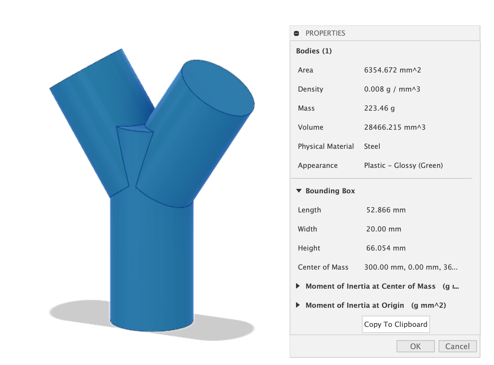

## Check the Bounding Box Size

Make sure your file is set to millimeters Check the properties of the component that you want to export to know the bounding box size.

The total bounding box should be less than 50mm in all directions.

Click on properties of the body or component in the browser. Right click on the component that you want to print. Then select properties.

Then you can see the bounding box dimensions. These should be below 50mm in all directions of x y and z.
