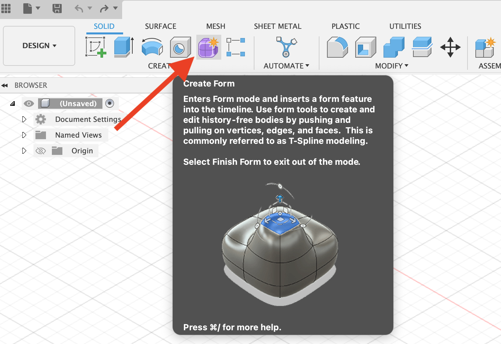
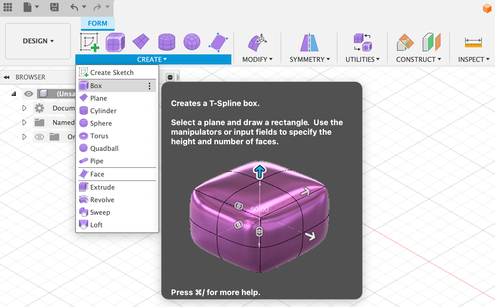

## Direct Modeling

Fusion 360 is a parametric modeling program. Specific dimensions, sketches, and constraints define how a 3D model is built. IF the order of actions is changed the model can be completely different. Parametric modeling is extremely powerful but it is not the only way to model. Fusion 360 also has a direct modeling mode. This mode does not capture any history on the design timeline. In some situations this can be ideal since one does not need to worry about timeline warnings about lost projections or geometry. It also has disadvantages since there is no design history to edit or revise. Even though direct modeling is less constrained, it is still much more rigid than organic mesh modeling.

## Form Workspace

Fusion has a version of mesh modeling called the Form workspace. In this workspace t-spline forms can be manipulated into complex organic shapes. Then once the form is complete, it is converted to a solid body and then all of the powerful parametric design features of Fusion can be used. By combining organic forms from the form workspace with precise parametric parts in the Design workspace unique and useful designs can be made.

To get to the Form workspace, click on the purple cube at the top of the solid menu in the Design workspace. This add new options for create and modify to the menu. Instead of seeing blue icons for the form primitives and modify commands, icons are purple, indicating that t-splines will be created. T-Splines are forms with vertices or points, edges or lines, and faces. The edges connect two points. and the faces are formed by 3 or more edges.

[Box vs Smooth Mode](https://youtu.be/B--0CElGp7s)
[T-Splines Introduction](https://youtu.be/8vGrRR_TLEg)

[Extrude Faces - Form Workspace](https://youtu.be/3YS1EX0rT0Y)
[Insert Edge Loop - Form Workspace](https://youtu.be/dVTDrUhsN3Y)
[Unweld Edges - Form Workspace](https://youtu.be/jNAzRU-Dbyg)
[Make Hole in T-Spline](https://youtu.be/3vat_r_MZ3k)
[Freeze T-Spline](https://youtu.be/4gbuQ8cRA3I)
[Crease T-Spline](https://youtu.be/_ijhpIGns-A)
