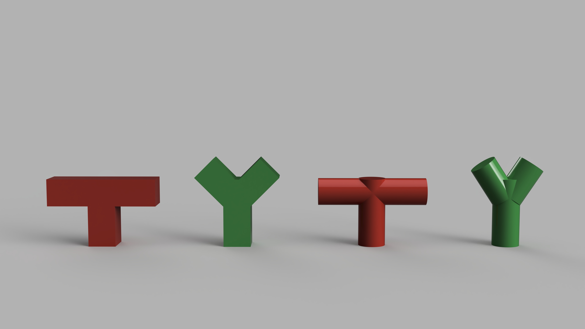

### General 3D Print Rules for FFD Printing without Dissolvable Supports

- Keep thin and small parts multiples of the nozzle size. The nozzle at the think[box] is .4mm absolute minimum size of fine objects is 1.2mm. A better size for thin walls and supports is 1.6mm. 1.5mm or 1.7 mm are not good. 2.0mm or 2.4mm are even better.
- Keep overhanging parts extending out less than 45 degrees. This allows layers to overlap a bit and slowly extend out wider. 45 degrees is the max otherwise the printer tries to print in mid air and all the filament falls to the ground.
- Objects must be fully connected and "manifold" or "watertight" You can't have pieces floating in the air or close but not touching. Don't have small voids. Make the pieces solid and uniform. You can have a hollow vase or container but all its parts and walls should be connected and solid.

Red models will not print without supports but green models will because they rise up at 45 degrees

Red models will not print without supports but green models will because they rise up at 45 degrees

Red models will not print without supports but green models will because they rise up at 45 degrees

### General Structural 3D Printing Guidelines

The following guidelines help achieve successful 3d Prints especially when designing containers, structural parts and pieces that need to be the correct size to match real world objects. These concepts still hold true for more organic creative work but may not be as necessary.

Example of model showing Mechanical 3D Print Guidelines

Gussets or supporting pieces like wings give more structure to elements.

Uniform Walls help with deformation and warping.

Fillets or rounded interior corners add strength and help with warping. Ribs also shown, connect vertical pieces to other vertical pieces or walls.

Chamfers or angled interior corners add strength and help with warping like fillets do.

Rounded Corners put less stress on the corners and are smoother to print.

We will not only 3D model on our computers, we will output our digital models into the physical world. We will use different processes to make physical models but the first technique will be 3D printing. 3D printing is a quick way to be able to hold a complex 3D model in your hands. Some models can only be made by 3D printing. 3D printing is an additive process, meaning material is added to existing material rather than being cut away such as with a saw.

The test prints will be small and must fit within a 50mm x 50mm x 50mm box. (50mm is approximately 2 inches) You can see the size of your model in Fusion under properties from the browser.

## Ideation Sketches

Using thumbnail sketches, quickly design numerous ideas for a 3D test print. For now think about a small size object of about 1 cubic inch. This can be bigger than an inch in size but the total volume of the object should be less than 1 cubic inch. Think about organic forms, negative spaces, curvilinear lines and geometric surfaces.

When you finish your sketches scan them and upload them to the class Google Drive following the instructions below.

### Required Sketches

- 10 thumbnail sketches minimum - These should be 10 different ideas. Draw without constraint. Do not limit your ideas.
- 5 larger refined ideations minimum<- Choose some of your ideas from your thumbnails. Refine them and iterate on the concepts. Which parts do you like and which parts can you change to make your ideas better.
- 1 larger refined drawing - Pick one of the 5 developed sketches and continue to refine it and change it. Draw it larger in perspective. You can add shading and details to help communicate your vision.

## Model your design in Fusion 360

## Check the Bounding Box Size

Make sure your file is set to millimeters Check the properties of the component that you want to export to know the bounding box size.

The total bounding box should be less than 50mm in all directions.

Click on properties of the body or component in the browser. Right click on the component that you want to print. Then select properties.

Then you can see the bounding box dimensions. These should be below 50mm in all directions of x y and z.

## Export STL file for 3D Test Print

- Watch the video on the tutorial page to export your model as an STL file.
- Choose File > 3D Print to save your STL Label the file YYYYMMDD Lastname Firstname 3D Test Print.stl

## Export .f3d file of Model from Fusion 360 Choose File > Export ... and save a .f3d version of your object.

## Apply materials and Export a Render Image

The 3D print will be a solid color of PLA plastic.

- Choose a color and apply that material to your model.
- Set up a render scene with a 1:1 or 16:9 or 2:3 aspect ratio.
- Make one of the dimensions a minimum of 4000px.
- Export a render image with a good composition.
- Don't make the object too small in the image.

## Assignment Deliverables

Upload the following items:

- scans of your ideation sketches
- STL file of model
- .f3d file of model
- render image

# Grading Rubric

| Assessment | Weight |
| ---------- | ------ |
