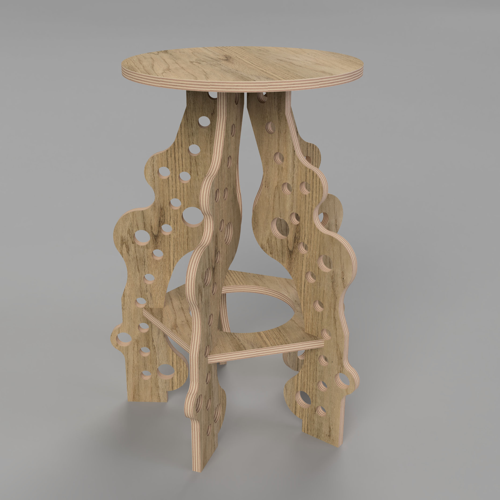

# CNC Stool / Chair / End Table / Game Console Stand

In this project we will design a stool, chair, end table or another large supportive device with an intended purpose such as perfectly holding a PS5.

Stools come in different heights and we may want to easily customize a stool with the same design but fabricate it at a different height without actually remodeling everything. With parametric modeling we can set the height of a stool as a user parameter in our model and then have other dimensions of the design driven by that height. Simply typing a new value for the height will update the rest of the model.

](cnc-stool-example.jpg

# Design Process

## Research

Before starting your project it is important to see what types of designs have been made. This can give you inspiration and new ideas for your project. You do not research other designs to copy them but to find out solutions that others have made. You can then take inspiration from those solutions and create your own designs and Concepts. This is an important part of any creative process.

<figure>

<figcaption>

[Google image Search of CNC Stools](https://google.com/search?q=cnc+stool&tbm=isch)

</figcaption>
</figure>

<figure>

<figcaption>

[Google image Search of CNC Chairs](https://google.com/search?q=cnc+chair&tbm=isch)

</figcaption>
</figure>

<figure>

<figcaption>

[Google image Search of Stool Design](https://google.com/search?q=stool+design&tbm=isch)

</figcaption>
</figure>

<figure>

<figcaption>

[Google image Search of CNC Tables](https://google.com/search?q=cnc+plywood+table&tbm=isch)

</figcaption>
</figure>

<figure>

<figcaption>

[Google image Search of CNC Joints](https://google.com/search?q=cnc+plywood+table&tbm=isch)

</figcaption>
</figure>

<figure>

<figcaption>

[Google image Search of Chair Living Hinges](https://google.com/search?q=cnc+plywood+table&tbm=isch)

</figcaption>
</figure>

## Collect Images

1.  Collect a minimum of 10 images of existing designs. You can take screenshots or download the images.
2.  Organize the images into a folder called “CNC Design Inspiration Images.” Label each of the images with a descriptive title that includes the creator’s name.
3.  Put each of these images into a Google Slides Presentation. Use one slide per image.
4.  On each slide write 2-3 sentences about why you selected this image and what your find intriguing about it.
5.  Put a link on each slide to where you found the image.
6.  Save the presentation as a PDF YYYYMMDD Lastname Firstname CNC Design Inspiration
7.  Upload the PDF and the folder of Images to Google Drive

## Research Design Parameters

Look up standard stool heights, chair sizes, and table sizes. You can simply enter these search terms into Google. Write down what you find. You do not have to make something a standard size but generally it is a good place to start your design process.

# Design Requirements

- Support the weight of a person or the intended item
- Have considered aesthetics
- Use 1/2" or 3/4" plywood
- Use more than 1 type of joint
- Have a considered and designed top surface, this could have engraving or decorative joints
- Be a relatively standard size
- Fit pieces on a half sheet of plywood or full sheet of plywood

# Assignment Deliverables Summary

1.  Folder of labeled design inspiration images (minimum 10)
2.  PDF export of Google Slides Presentation of design inspiration
3.  Minimum 10 Thumbnail Ideation Sketches
4.  Minimum 5 larger refined Ideation Sketches
5.  1 Larger Final Sketch of Design with dimensions
6.  Minimum of 2 photos of scale Cardboard Model

# Project Resources

CIA Fab Studios Online Store - [https://my.cia.edu/ICS/Student/Supply_Store/Fabrication_Studios/Wood/](https://my.cia.edu/ICS/Student/Supply_Store/Fabrication_Studios/Wood/)

The Fab Studios sells pre-cut half sheets of 1/2" and 3/4" plywood. You can purchase it online at the Fab Studios' online store on myCIA.

## Grading Rubric

| Assessment      | Weight    |
| --------------- | --------- |
| Design Research | 20 points |
| File Management | 10 points |

