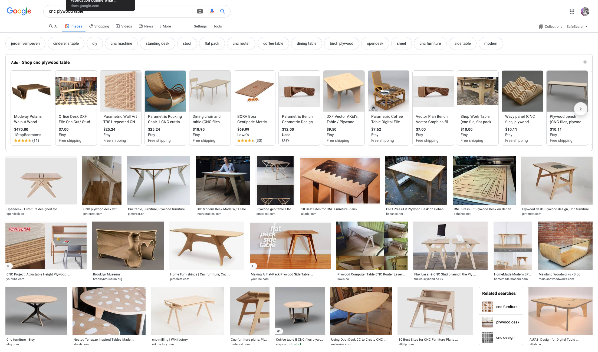

# CNC Stool / Chair / End Table / Game Console Stand

We will continue learning parametric modeling in Fusion 360\. Parametric modeling allows us to change our design depending on the materials that will be used to fabricate it as well as certain parameters that we might want to change for different users. In this project we will design a stool, chair, end table or another large supportive device with an intended purpose such as perfectly holding a PS5.

Stools come in different heights and we may want to easily customize a stool with the same design but fabricate it at a different height without actually remodeling everything. With parametric modeling we can set the height of a stool as a user parameter in our model and then have other dimensions of the design driven by that height. Simply typing a new value for the height will update the rest of the model.

In the previous project we learned about user parameters. We will continue to use user parameters in our designs and learn how to use formulas to make other dimensions driven by parameters.

In this project it is important that your 3D Digital Model is robust. What does that mean to have a robust model? When you use the dimension of ply for the thickness of the plywood you should periodically test different values of "ply" and any other user parameters that you have set. Check to see if you model updates and each piece is referenencing the size of other pieces. It is a good idea to change to value of ply each time you make a new component or piece of your model to make sure all the parameters are changing the model as expected.

# CNC Routers vs Laser Cutters

There are differences between a laser cutter and a CNC router. These differences include, kerf size, need for holding down a workpiece and the ability of the router to make pocket cuts or cuts that don’t go all the way through the material.

There are differences between a laser cutter and a CNC router. These differences include, kerf size, need for holding down a workpiece and the ability of the router to make pocket cuts or cuts that don’t go all the way through the material.

Laser cutters burn the edges of wood materials while CNC routers make a clean cut on the edges of plywood. Laser cutters have a limit on the size of the material thickness while CNC routers can cut through much thicker materials. This often requires multiple passes of the router bit over the material. When creating toolpaths, this "stepdown" ammount will be important. It is typically 1/2 of the diameter of your tool bit.

<iframe class="youtube-iframe" style="position: absolute; top: 0; bottom: 0; left: 0; width: 100%; height: 100%; border: 0; z-index: 1;" src="https://www.youtube.com/embed/oYxp6FXG27I?rel=0" width="560" height="315" frameborder="0" allowfullscreen="allowfullscreen"></iframe>

## Kerf Size and Dogbone Fillets

A laser cutter has a very thin beam and although it can't cut a perfect inside corner, the corners it cuts are very square compared to the larger curves required by a CNC router bit. The default CNC router bit we will use on the Shopbot is ¼ in. The laser cutter beam is merely 0.127 mm. Because of this larger kerf on the Shopbot we need to account for that on inside corners. We will use a technique called “dog bone fillets” to make space for our slots to fit in. These are called dog bone fillets because they look like cartoon dog bones. We can add these fillets parametrically in Fusion 360\. The fillets are required for square parts to fit into inside corners.

There are two methods of making dogbone fillets, one is the classic "cartoon dogbone" and the other are "invisible". They are still cut into the wood but are positioned so the connecting piece covers the cuts and therefore the fillets are not seen in the final project.

<iframe class="youtube-iframe" style="position: absolute; top: 0; bottom: 0; left: 0; width: 100%; height: 100%; border: 0; z-index: 1;" src="https://www.youtube.com/embed/fjrEmJeM-qw?rel=0" width="560" height="315" frameborder="0" allowfullscreen="allowfullscreen"></iframe>

## Securing the Workpiece

On the laser cutter we merely set our piece inside the cutter and don't need to hold it down. The router is a much larger and powerful machine and will knock the workpiece all over the place causing damage and potential injury. We need to firmly secure our material to the router table before using the machine. It is important to make sure that any Fasteners used to secure the workpiece do not come in contact with the spinning router bit.

## Pocket Cuts and Joints

The laser cutter can only etch on to the surface of the material or cut all the way through. The router can make 3 dimensional cuts. It can round off the top and make three-dimensional sculptural forms by cutting away parts of the material. I can also make a pocket cut. A pocket cut is a cut that does not go all the way through the base material. This is not possible with a laser cutter.

We will use pocket cuts to secure different parts of our projects. This is a convenient way to make tabs on one part slot into another supporting piece. It is also way to hide the construction and undesirable joints that we don't want to see in the final design.

Aditional joints that can be made by CNC machines are lap joints, mitered lap joints, t-lap joints, mortise and tennon joints, keyed mortise and tennon joints and many others. This [Google Image Search](https://google.com/search?q=cnc+joints&tbm=isch) shows a great variety of [CNC joints](https://google.com/search?q=cnc+joints&tbm=isch) to try in your project.

<iframe class="youtube-iframe" style="position: absolute; top: 0; bottom: 0; left: 0; width: 100%; height: 100%; border: 0; z-index: 1;" src="https://www.youtube.com/embed/O5IR9pr9vdo?rel=0" width="560" height="315" frameborder="0" allowfullscreen="allowfullscreen"></iframe>

# Design Process

## Research

Before starting your project it is important to see what types of designs have been made. This can give you inspiration and new ideas for your project. You do not research other designs to copy them but to find out solutions that others have made. You can then take inspiration from those solutions and create your own designs and Concepts. This is an important part of any creative process.

[Google image Search of CNC Stools](https://google.com/search?q=cnc+stool&tbm=isch)

[Google image Search of CNC Chairs](https://google.com/search?q=cnc+chair&tbm=isch)

[Google image Search of Stool Design](https://google.com/search?q=stool+design&tbm=isch)

[Google image Search of CNC Tables](https://google.com/search?q=cnc+plywood+table&tbm=isch)

[Google image Search of CNC Joints](https://google.com/search?q=cnc+plywood+table&tbm=isch)

[Google image Search of Chair Living Hinges](https://google.com/search?q=cnc+plywood+table&tbm=isch)

## Collect Images

1.  Collect a minimum of 10 images of existing designs. You can take screenshots or download the images.
2.  Organize the images into a folder called “CNC Design Inspiration Images.” Label each of the images with a descriptive title that includes the creator’s name.
3.  Put each of these images into a Google Slides Presentation. Use one slide per image.
4.  On each slide write 2-3 sentences about why you selected this image and what your find intriguing about it.
5.  Put a link on each slide to where you found the image.
6.  Save the presentation as a PDF YYYYMMDD Lastname Firstname CNC Design Inspiration
7.  Upload the PDF and the folder of Images to Google Drive

## Research Design Parameters

Look up standard stool heights, chair sizes, and table sizes. You can simply enter these search terms into Google. Write down what you find. You do not have to make something a standard size but generally it is a good place to start your design process.

# Design Requirements

- Support the weight of a person or the intended item
- Have considered aesthetics
- Use 1/2" or 3/4" plywood
- Use more than 1 type of joint
- Have a considered and designed top surface, this could have engraving or decorative joints
- Be a relatively standard size
- Fit pieces on a half sheet of plywood or full sheet of plywood

## Ideation Sketches

1.  Make a minimum of 10 thumbnail sketches of ideas. Keep the ideas varied and different. Push yourself to be inspired by designs you researched but to come up with your own ideas and concepts.
2.  After making initial sketches, choose 5 ideas and make larger refined sketches. You may need to draw these from different views and show details of how you plan to join the pieces together.
3.  Choose your favorite idea and draw a larger final sketch. This could be a third angle projection drawn by hand or with a t-square that includes the Front, Top and Right views. It could also be a detailed rendered iage that is descriptive of its form and construction. Put dimensions on you drawing.
4.  Scan or photograph your sketches. If using a scanner, make sure that the DPI is high enough and that the exposure on the scanner captures enough detail, especially if you have light sketches. If you are photographing your sketches, ensure that there is even lighting, no shadows. Make sure that there are no extra items in the photo. Make sure there are no distortions or trapezoid shapes from taking the photo at an angle. Keep the camera square to the paper.
5.  Label you files YYYYMMDD Lastname Firstname CNC Ideation Sketches
6.  Upload to Google Drive

## Make a Scale Cardboard Model

Make a cardboard model of your design. It is one thing to draw with pencil on paper, it is another to make a physical object. Problems and solutions that may not be apparent in your drawing will reveal themselves when you make a physical object. The model will be smaller than actual size.

You can cut the cardboard with hand tools or the laser cutter or both.

We will be using ¾” or ½” plywood for this project. You can use a ratio to scale your model.

Measure the cardboard and use a ratio calculator to scale your model dimensions.

First calculate the scale factor of your materials. If your single sheet of cardboard measures ~3.3mm and 3/4" plywood is ~18mm then you have a scale factor of 11:60\. This website can easily calculate the scale factor for you. [https://www.ginifab.com/feeds/cm_to_inch/scale_factor_calculator.html](https://www.ginifab.com/feeds/cm_to_inch/scale_factor_calculator.html)

Once you know the scale factor then you can determine how big the pieces of your cardboard model should be based on that scale factor. This website lets you enter a scale factor and then enter in your final desired design dimension. For example if you want something 30" tall, you put in a scale factor of 11:60, type 30" in the "real length" and set the "scale length" to mm to get the scaled model size in mm. (You can use inches for your cardboard model but millimeters are soooo much easier to use, count, divide. Notice I put in 30" because for some distances I know imperial units better but then I quickly convert to the easier to use metric system. Make sure you always double check your units.) This website will scale all your numbers. [https://www.ginifab.com/feeds/cm_to_inch/scale_converter.html](https://www.ginifab.com/feeds/cm_to_inch/scale_converter.html)

<iframe class="youtube-iframe" style="position: absolute; top: 0; bottom: 0; left: 0; width: 100%; height: 100%; border: 0; z-index: 1;" src="https://www.youtube.com/embed/j-KeJDNf9HQ?rel=0" width="560" height="315" frameborder="0" allowfullscreen="allowfullscreen"></iframe>

<iframe class="youtube-iframe" style="position: absolute; top: 0; bottom: 0; left: 0; width: 100%; height: 100%; border: 0; z-index: 1;" src="https://www.youtube.com/embed/Tm7xTiLl4Hw?rel=0" width="560" height="315" frameborder="0"></iframe>

## Photo Documentation of Cardboard Model

Take a minimum of two photos of your model. Take one from a 3/4 angle that shows a good representation of the form. Take the other from a composition of your choice.

Set up lights and a clean backdrop. You can check out lights and a camera from the CIA equipment checkout. You can also take your model to the think[box] and use the soft boxes and flashes already set up. Shoot in JPG and RAW and post process the images. [White balance should be corrected](https://www.youtube.com/watch?v=m0yZEWUSahk) and the levels should be adjusted to have good exposure. Use Photoshop and [Adobe Camera Raw](https://www.youtube.com/watch?v=11jwSwUu2WI) to make adjustments and to retouch any mistakes in the images. Label the photos YYYYMMDD CNC Cardboard Model

<iframe class="youtube-iframe" style="position: absolute; top: 0; bottom: 0; left: 0; width: 100%; height: 100%; border: 0; z-index: 1;" src="https://www.youtube.com/embed/Cq_Cx_5Zhks?rel=0" width="560" height="315" frameborder="0" allowfullscreen="allowfullscreen"></iframe>

# Assignment Deliverables Summary

1.  Folder of labeled design inspiration images (minimum 10)
2.  PDF export of Google Slides Presentation of design inspiration
3.  Minimum 10 Thumbnail Ideation Sketches
4.  Minimum 5 larger refined Ideation Sketches
5.  1 Larger Final Sketch of Design with dimensions
6.  Minimum of 2 photos of scale Cardboard Model

Upload everything in a single folder to the class Google Drive Folder

## Google Drive Folder Link

Link: [https://drive.google.com/drive/folders/1a1F1QWe0wM3KxJtZBd3XlCcKK_l8zar2](https://drive.google.com/drive/folders/1a1F1QWe0wM3KxJtZBd3XlCcKK_l8zar2)

# Project Resources

CIA Fab Studios Online Store - [https://my.cia.edu/ICS/Student/Supply_Store/Fabrication_Studios/Wood/](https://my.cia.edu/ICS/Student/Supply_Store/Fabrication_Studios/Wood/)

The Fab Studios sells pre-cut half sheets of 1/2" and 3/4" plywood. You can purchase it online at the Fab Studios' online store on myCIA.

## Fusion 360 CNC Tutorial Videos

## Scale Cardboard Model to Plywood Thickness

<iframe class="youtube-iframe" style="position: absolute; top: 0; bottom: 0; left: 0; width: 100%; height: 100%; border: 0; z-index: 1;" src="https://www.youtube.com/embed/j-KeJDNf9HQ
                    ?rel=0" width="560" height="315" frameborder="0" allowfullscreen="allowfullscreen"></iframe>

## Laser Cutting vs CNC Router

<iframe class="youtube-iframe" style="position: absolute; top: 0; bottom: 0; left: 0; width: 100%; height: 100%; border: 0; z-index: 1;" src="https://www.youtube.com/embed/oYxp6FXG27I?rel=0" width="560" height="315" frameborder="0" allowfullscreen="allowfullscreen"></iframe>

## Simple CNC Joints

<iframe class="youtube-iframe" style="position: absolute; top: 0; bottom: 0; left: 0; width: 100%; height: 100%; border: 0; z-index: 1;" src="https://www.youtube.com/embed/O5IR9pr9vdo?rel=0" width="560" height="315" frameborder="0" allowfullscreen="allowfullscreen"></iframe>

## Invisible Dogbone Fillets

<iframe class="youtube-iframe" style="position: absolute; top: 0; bottom: 0; left: 0; width: 100%; height: 100%; border: 0; z-index: 1;" src="https://www.youtube.com/embed/fjrEmJeM-qw?rel=0" width="560" height="315" frameborder="0" allowfullscreen="allowfullscreen"></iframe>

## Create ShopBot Tool Fusion

<iframe class="youtube-iframe" style="position: absolute; top: 0; bottom: 0; left: 0; width: 100%; height: 100%; border: 0; z-index: 1;" src="https://www.youtube.com/embed/M9MQzYrLhGQ?rel=0" width="560" height="315" frameborder="0" allowfullscreen="allowfullscreen"></iframe>

## Creat ShopBot Toolpaths in Fusion

<iframe class="youtube-iframe" style="position: absolute; top: 0; bottom: 0; left: 0; width: 100%; height: 100%; border: 0; z-index: 1;" src="https://www.youtube.com/embed/_G-0i8BFEFs?rel=0" width="560" height="315" frameborder="0" allowfullscreen="allowfullscreen"></iframe>

## CNC Hex Stool

<iframe class="youtube-iframe" style="position: absolute; top: 0; bottom: 0; left: 0; width: 100%; height: 100%; border: 0; z-index: 1;" src="https://www.youtube.com/embed/9utpuieg5lI?rel=0" width="560" height="315" frameborder="0" allowfullscreen="allowfullscreen"></iframe>

## CNC End Table

<iframe class="youtube-iframe" style="position: absolute; top: 0; bottom: 0; left: 0; width: 100%; height: 100%; border: 0; z-index: 1;" src="https://www.youtube.com/embed/GzknioA34F8?rel=0" width="560" height="315" frameborder="0" allowfullscreen="allowfullscreen"></iframe>

## CNC Two Level Table

<iframe class="youtube-iframe" style="position: absolute; top: 0; bottom: 0; left: 0; width: 100%; height: 100%; border: 0; z-index: 1;" src="https://www.youtube.com/embed/I6FEMdtcrpI
                    ?rel=0" width="560" height="315" frameborder="0" allowfullscreen="allowfullscreen"></iframe>

## CNC Plywood Chair

<iframe class="youtube-iframe" style="position: absolute; top: 0; bottom: 0; left: 0; width: 100%; height: 100%; border: 0; z-index: 1;" src="https://www.youtube.com/embed/GqXQ8TdzYRE?rel=0" width="560" height="315" frameborder="0" allowfullscreen="allowfullscreen"></iframe>

## Document Art with Cellphone

<iframe class="youtube-iframe" style="position: absolute; top: 0; bottom: 0; left: 0; width: 100%; height: 100%; border: 0; z-index: 1;" src="https://www.youtube.com/embed/Cq_Cx_5Zhks?rel=0" width="560" height="315" frameborder="0" allowfullscreen="allowfullscreen"></iframe>

## Open Any Image in Camera Raw

<iframe class="youtube-iframe" style="position: absolute; top: 0; bottom: 0; left: 0; width: 100%; height: 100%; border: 0; z-index: 1;" src="https://www.youtube.com/embed/ftMICesJwGc?rel=0" width="560" height="315" frameborder="0" allowfullscreen="allowfullscreen"></iframe>

## Quick White Balance in Photoshop

<iframe class="youtube-iframe" style="position: absolute; top: 0; bottom: 0; left: 0; width: 100%; height: 100%; border: 0; z-index: 1;" src="https://www.youtube.com/embed/m0yZEWUSahk?rel=0" width="560" height="315" frameborder="0" allowfullscreen="allowfullscreen"></iframe>

## Camera Raw Tutorial

<iframe class="youtube-iframe" style="position: absolute; top: 0; bottom: 0; left: 0; width: 100%; height: 100%; border: 0; z-index: 1;" src="https://www.youtube.com/embed/11jwSwUu2WI?rel=0" width="560" height="315" frameborder="0" allowfullscreen="allowfullscreen"></iframe>

# Grading Rubric

| Assesment                     | Weight    |
| ----------------------------- | --------- |
| Design Research               | 20 points |
| 10 thumnails                  | 10 points |
| 5 revised sketches            | 20 points |
| Larger Final Sketch           | 20 points |
| Sketch Documentation          | 10 points |
| Cardboard Model               | 20 points |
| Cardboard Model Documentation | 20 points |
| File Management               | 10 points |
