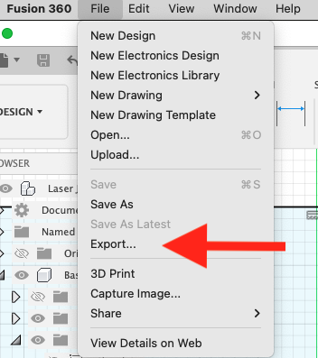
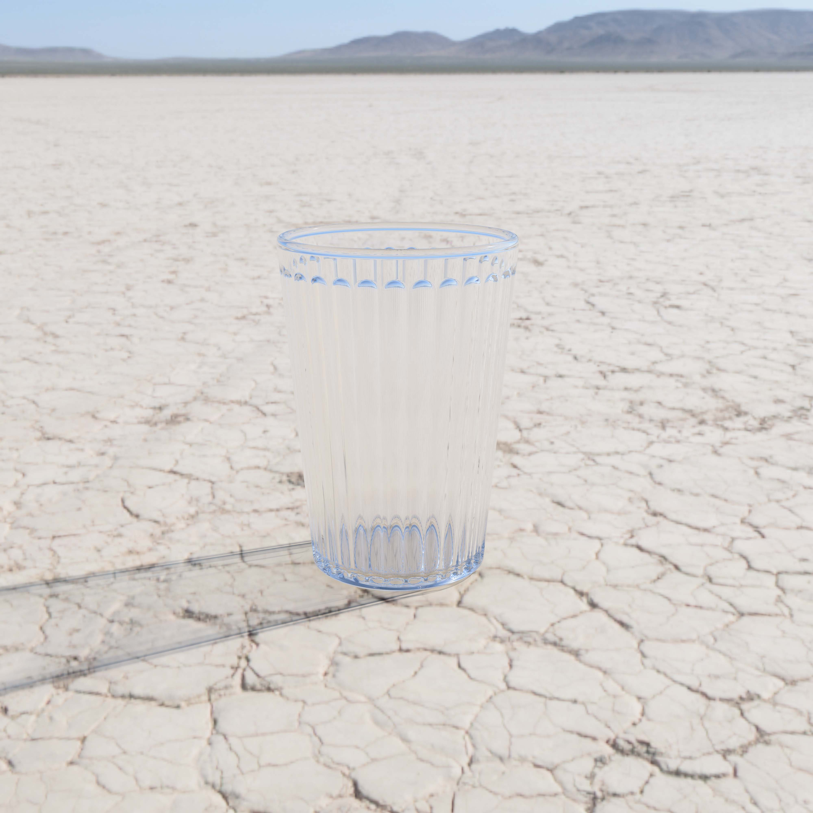
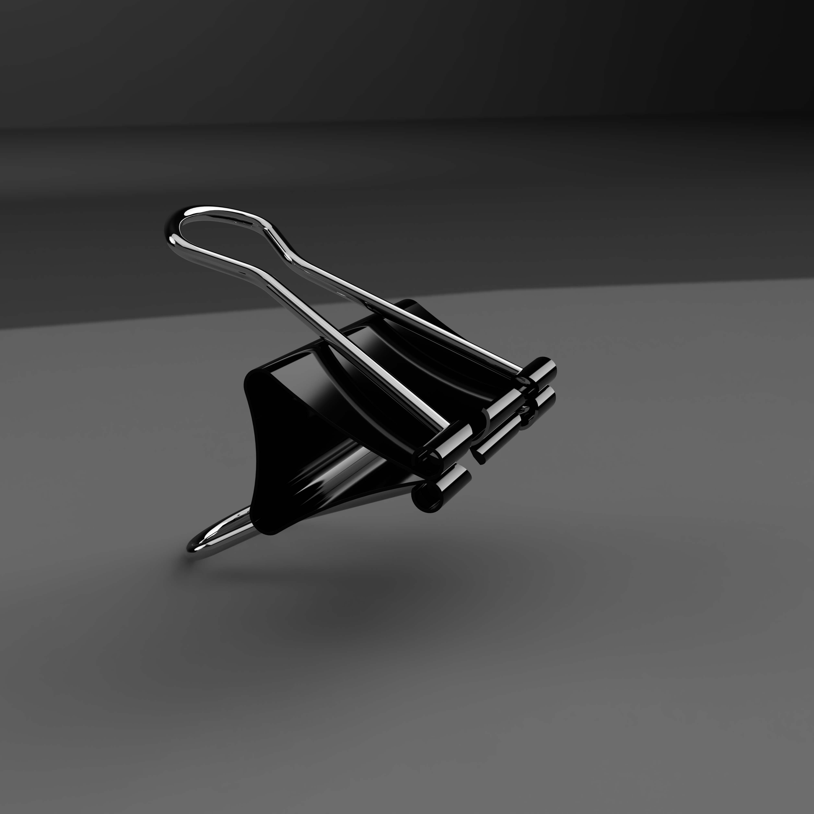

## Deliverables

Upload the following:

- 2 high resolution, labeled render files
- 2 exported Fusion 360 .f3d files

Label your files:

- YYYYMMDD Lastname Firstname Render Image 1.png/jpg
- YYYYMMDD Lastname Firstname Render Image 2.png/jpg
- YYYYMMDD Lastname Firstname Fusion 360 model 1.f3d
- YYYYMMDD Lastname Firstname Fusion 360 model 1=2.f3d

## Instructions

Using your third angle projection sketches, make a model of at least one of your objects in Fusion 360. Use [Rule Number 1](https://youtu.be/ZYXSJ6EQ9S4) to divide you object into components. Label your components and make sure to activate each component when you are working on it. It is easy to forget which component is activated so it is good practice to right click on the component and isolate it so it is the only thing you can see. Remember to click the dot in the browser to activate the component that you want to work on so that the design history in the timeline stays with that component.

You must model 2 of your objects but you may model more of your objects. Make sure you have all of the dimensions that you need in your third angle projection sketch. If you do not have all the dimensions on your sketch, remeasure your object so you have the information needed to make an accurate model in Fusion 360. If you do not like the objects from your third angle projections, you can choose new objects. Draw new third angle projections with dimensions so you can make the 3D models.

There is no "right" way to model your object. Try to think of the main shapes. Break those down into pieces and then model the main form. Add details after you get the main forms. Look at the example videos to see different techniques and approaches to modeling simple objects.

## Apply Materials to the Models

You should apply materials to each part of your model. Experiment with different materials. You can edit materials that have been applied to change the color of the materials to match your object. By default, materials apply to bodies and components. If you only want a material to apply to one face of an object, click the button on the top of the appearance menu that says faces.

## Render the Models

In the Render workspace, select an environment that you want. Rotate and position the model. Change any lighting preferences. Then click on the teapot. You can render in the cloud so your computer does not have to do the work. You can submit multiple renders of different views and angles. After the renders are complete in the cloud you can download them to your computer. Make sure the render are high resolution. The max resolution that Fusion renders at is 4000x4000 pixels. You don't need to render in high resolution when making test renders but after you finalize your model and materials, export a 4000x4000 pixel render.

## Download Fusion .f3d files

Download the Fusion 360 model files to your computer. To download a .f3d file you need to go to the file menu and click "...export". Then you can save a .f3d file to your computer. Upload the .f3d files along with your render images to Google Drive.

.f3d Files are a way to share Fusion models. If you have questions about your model during this assignment or during this course, download your .f3d file and send your questions and .f3d file to your instructor via email.

    

From the File menu select Export ...

[Fusion 360 Export f3d](2022-Fusion-360-Export-f3d.png)

In the save file menu, select a location on your computer and choose .f3d for the file type.

## HDRI Environment Photos for Render Backgrounds

Here is a generous website of Greg Zaal, a CG artist offering their HDRI photos for free. They are licensed under CCO. The artist asks for credit to be mentioned so please do that but you can use these photos for any use.

Download the photo that you want and then you can attach a custom environment in the Fusion 360 Render environment. Then you can use it as the background for renders of your models. This [video](https://www.youtube.com/MmJL4zjfmic) shows how to insert a custom HDRI background.

[https://polyhaven.com/](https://polyhaven.com/)

## Example Fusion 360 Renders of Simple Objects

Toy Block with Environmentcontent

Drinking Glass with Custom HDRI

Drinking Glass with Environment

Drinking Glass with Transparent Background

Binder Clip with Environment

Binder Clip with Transparent Background

# Helpful Videos

## 4\. Model USB Plug from Third Angle Projection

<iframe class="youTubeIframe" src="https://www.youtube.com/embed/VLx9AsbZ8R0?rel=0" width="300" height="150" allowfullscreen="allowfullscreen"></iframe>

## 5\. Model Toy Block

<iframe class="youTubeIframe" src="https://www.youtube.com/embed/OJx09e5SrEw?rel=0" width="300" height="150" allowfullscreen="allowfullscreen"></iframe>

## 6\. Model Drinking Glass

<iframe class="youTubeIframe" src="https://www.youtube.com/embed/2agSzLpN8Z0?rel=0" width="300" height="150" allowfullscreen="allowfullscreen"></iframe>

## 7\. Model Binder Clip

<iframe class="youTubeIframe" src="https://www.youtube.com/embed/MLphWafTfWY?rel=0" width="300" height="150" allowfullscreen="allowfullscreen"></iframe>

## 8\. Custom HDRI Background

<iframe class="youTubeIframe" src="https://www.youtube.com/embed/MmJL4zjfmic?rel=0" width="300" height="150" allowfullscreen="allowfullscreen"></iframe>

