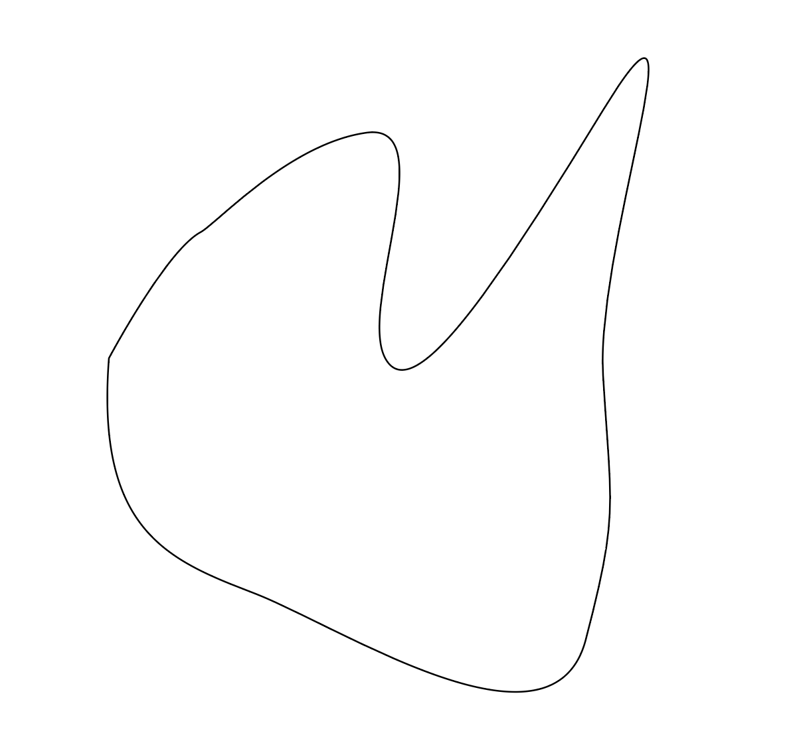

# Create Laser Cut Test File

Next week we will go to the think/[box/] to learn how to use the laser cutters.
We will each make a test cut from a file that we make. You need to have this
file made before class next week. There are specific instructions to make
the file in Adobe Illustrator. If you do not follow the directions then your
file will not work

| Open Adobe Illustrator                                                               |                                                                            |
| ------------------------------------------------------------------------------------ | -------------------------------------------------------------------------- |
| Create a New Document that is 12 inches by 12 inches in RGB color                    |  |
| _Draw path that is closed _ Keep the path away from the edges of the 12x12 artboard. |  |
|                                                                                      |                                                                            |

dolor sit amet, consectetur adipiscing elit, sed do eiusmod tempor
incididunt ut labore et dolore magna aliqua. Pellentesque eu tincidunt tortor
aliquam nulla facilisi cras fermentum odio. A erat nam at lectus urna duis.
Sed velit dignissim sodales ut eu sem. Lectus urna duis convallis convallis
tellus. Diam sit amet nisl suscipit adipiscing bibendum est. Sed felis eget
velit aliquet sagittis id consectetur. Vulputate dignissim suspendisse in est
ante in nibh mauris cursus. Morbi quis commodo odio aenean. Mollis nunc sed id
semper risus in hendrerit gravida rutrum.

<!--more-->

Ac ut consequat semper viverra nam. Hac habitasse platea dictumst vestibulum
rhoncus. Amet porttitor eget dolor morbi non. Justo eget magna fermentum
iaculis eu non. Id eu nisl nunc mi ipsum faucibus vitae aliquet nec. Aliquam
id diam maecenas ultricies. Non sodales neque sodales ut etiam. Amet massa
vitae tortor condimentum lacinia quis. Erat imperdiet sed euismod nisi porta.
Nisl suscipit adipiscing bibendum est ultricies integer quis auctor. Viverra
suspendisse potenti nullam ac. Tincidunt id aliquet risus feugiat in. Varius
quam quisque id diam vel. Egestas erat imperdiet sed euismod nisi. Scelerisque
felis imperdiet proin fermentum leo vel orci porta non. Ut faucibus pulvinar
elementum integer. Fermentum odio eu feugiat pretium nibh ipsum consequat nisl.
